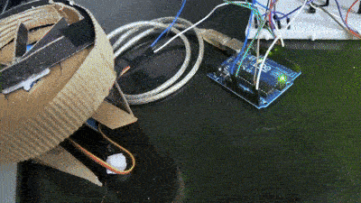
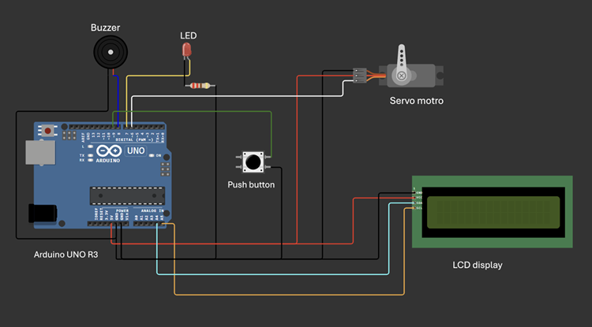

## Abstract 
An automatic pill dispenser is a microcontroller-based device designed to manage and 
dispense prescribed medication at fixed time intervals. This project aims to assist 
individuals—especially the elderly and patients with chronic illnesses—by automating their 
medication routine. Unlike systems that rely on Real-Time Clocks (RTC), this device utilizes 
the built-in timer of a microcontroller to schedule pill dispensing after fixed durations. A 
programmed system triggers an alert mechanism using a buzzer and LCD display, ensuring 
user awareness. The project integrates basic hardware and software components to create an 
affordable, standalone system that enhances medication adherence and reduces dosage errors. 
Introduction 

## Overview 
In modern healthcare, medication management plays a crucial role, particularly for patients 
requiring multiple doses daily. Manual pill administration can lead to errors. The automatic 
pill dispenser addresses these issues by dispensing pills at predefined intervals using a 
programmable microcontroller. 
Objectives 
• To design a compact, user-friendly pill dispenser. 
• To automate pill delivery with scheduled timing. 
• To provide real-time alerts to users. 
• To reduce the risk of missed or wrong dosages. 
## Motivation 
The motivation for developing this project is to provide a cost-effective, user-friendly, and 
autonomous solution that simplifies the task of managing medication schedules. By 
automating the process, the system reduces the dependence on human intervention, 
minimizes errors, and promotes better health outcomes. The goal is to build a device that is 
accessible to all, especially those who live alone or in remote areas, and ensure that no dose is 
missed due to forgetfulness or confusion. 
This project represents a practical application of embedded systems to solve real-world health 
challenges and improve the quality of life for vulnerable populations. 

## Circuit Diagram 

Explanation: The circuit comprises a microcontroller powered by a 9V adapter, connected to 
servo motors, a buzzer, and an LCD display. Proper current limiting and voltage regulation 
are ensured. 
## Hardware Used 
• Arduino Uno (ATmega328P) 
• Servo Motors (SG90) 
• Buzzer 
• 16x2 LCD Display 
• Power Supply (9V Adapter) 
• Pill Compartments (Rotating Disc or Slide Mechanism) 
## Software Used 
• Arduino IDE 
• Wokwi (for simulation and circuit diagrams) 
• Embedded C/C++ 
## Methodology 
1. Set predefined interval durations in the Arduino program (e.g., every 6 hours). 
2. Use millis() or internal timer interrupts to track elapsed time. 
3. When the set interval elapses, activate motor to dispense pill. 
4. Trigger buzzer and display message on LCD. 
5. Wait for user confirmation or timeout before resuming countdown. 
6. Repeat for subsequent intervals.

